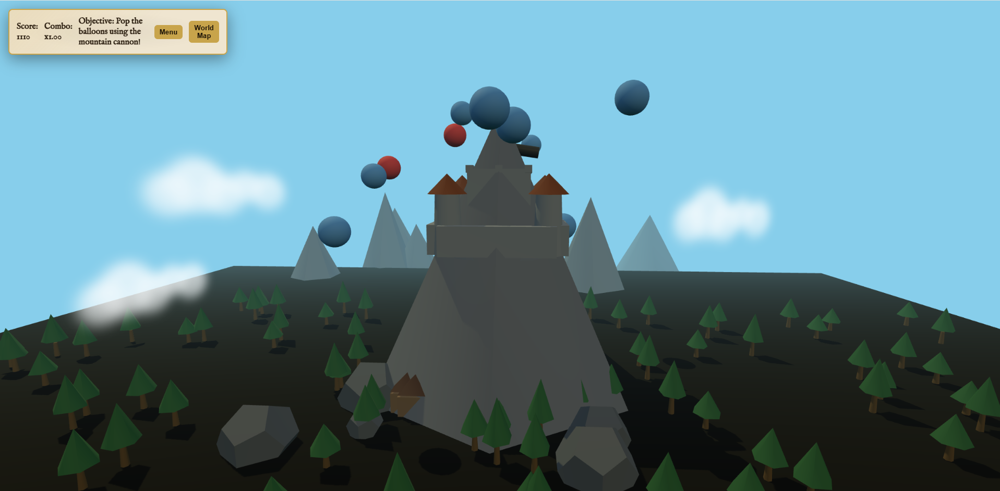

# Scars on the Mountain Peak

A small WebGL mini-collection built with TypeScript, Three.js, and Vite. It includes two arcade-style games you can launch from the in-game menu:

- Castle: Mountain Cannon — defend the peak castle and pop balloons with a multi-directional cannon
- Infinity Road (F1) — overtake traffic on an endless highway with speed-up/brake controls and animated roadside scenery

## Preview

> Tip: Save your screenshot image as `public/assets/screenshot.png` so it appears here.

## Features

- TypeScript + Three.js + Vite project setup
- Foggy bright-sky mountain scene with castle, clouds, and trees
- Multi-directional cannon with pointer-lock aiming and recoil
- Balloon targets with scoring, combos, and simple SFX
- Main menu launcher to pick between two games
- Infinity Road car game with acceleration/brake, animated lane markers, and parallax trees

## Controls

Castle: Mountain Cannon
- Mouse: click the cannon to enter Cannon Mode, move to aim, click to shoot
- E or Esc: exit Cannon Mode
- Pop balloons to score (red = higher score)

Infinity Road (F1)
- Left/Right Arrow or A/D: change lanes
- Up Arrow or W: accelerate
- Down Arrow or S: brake

## Getting Started

1) Install dependencies
- npm install

2) Run the dev server
- npm run dev

Open the browser tab that Vite launches.

3) Build for production
- npm run build
- npm run preview

## Project Structure

- index.html, styles.css — shell and UI
- src/core — main mountain game code (Game, Player, entities, world, UI)
- src/car — Infinity Road car game
- public/assets — static assets (textures, audio, screenshot)

## Tech

- three (WebGL rendering)
- TypeScript
- Vite (bundling/dev server)

## License

MIT
